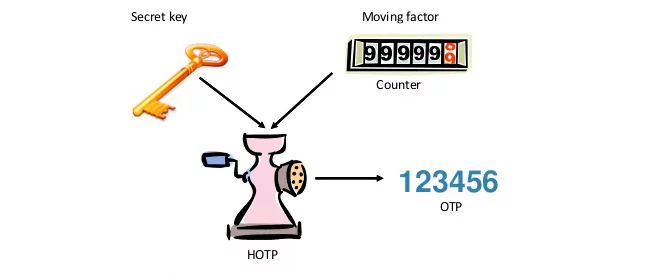
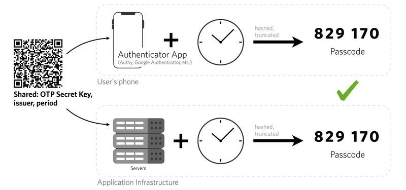
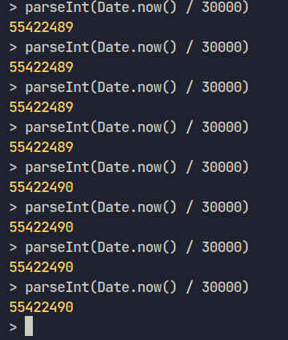

<p align="center">
  

  <h3 align="center">simple TOTP implementation</h3>

</p>


- simple TOTP implementation following some of the specs [RFC 6238](https://www.rfc-editor.org/rfc/rfc6238) so i can understand the idea and the concept 
of offline authenticator apps 😇.

## Usage 

1. Clone the repo

```sh
git clone https://github.com/civilcoder55/simple-totp-implementation.git
```

2. create file and import index.js. there is two function generateSecret and generateOTP


3. 
```js
import { generateTOTP, generateSecret } from "./index.js";


const secret = generateSecret() 
console.log(secret) // 67GKB4XF4QBX34XLPEV6MTBD23KO7LU4

const totp = generateTOTP(secret) /
console.log(totp) // 963081
```


## screens

<p align="center">
  
</p>

## break down code output to make sure i understand every line

the concept of TOTP is very simple

- we create a random secret and encode it as base32 without padding so it can be compatable with compatibile with authenticator apps 

- after register this secret to authenticator app, this is what the app do to generate code in simple steps

  - create a counter value from current timestamp in seconds divided by timeframe (most cases is 30 seconds) and we take the int value of the output so now we generate same counter in every try during the 30 seconds timeframe
  <p align="center">
    
  </p>
  
  - we need to convert this counter to 8-byte array,
    this is a one way to convert in nodejs 
    ```js
    const buf = Buffer.alloc(8);

    for (let i = 0; i < 8; i++) {
      buf[7 - i] = counter & 0xff;
      counter = counter >> 8;
    }
    ```

    but maybe your language provide with built in function to do so like in python

    ```python
    int = 55416990
    a_bytes = int.to_bytes(8, 'big')
    print(a_bytes) # b'\x00\x00\x00\x00\x03\x4d\x98\x9e'
    ```


  - create hmac with the secret key and 8-byte counter with sha1 algorithm , this will output 20-byte array

  - then we get the offset index by getting 4 bits from last byte of hmac

  - then we take 4 bytes starting from the offset index

  - by this we will have 32-bit number

  - calculate most significant bit of first offset byte so now we have 31-bit number
  this is one way to do it with bitwise operators
  ```js
  let code = (digest[offset] & 0x7f) << 24 |
    (digest[offset + 1] & 0xff) << 16 |
    (digest[offset + 2] & 0xff) << 8 |
    (digest[offset + 3] & 0xff);
  ```

  but it's simple and can be done 
  ```js
  const buf2 = Buffer.alloc(4);
  buf2[0] = digest[offset] & 0x7f
  buf2[1] = digest[offset + 1]
  buf2[2] = digest[offset + 2]
  buf2[3] = digest[offset + 3]
  code = buf2.readUInt32BE() % 100000000 // 8 digits
  ```

  - and finally calculate the output of 31-bit number mod 10^8

  - we will get 8 digits then we can took the last 6 digits as out totp


## draft
```
let counter = 55416990
OAIERWLTDY5NNOOT5XIPNWIJBZL3SSTA

mask 0xff over number to get last 8
ex: 11010011011001100010011110 & 00000000000000000011111111 = 10011110 [55416990 => 158]
shift 8 and get ready to loop over the next batch of 8
ex: 11010011011001100010011110 = 00000000110100110110011000

get offset from hmac last byte 
ex: 00000000000000000000111000 & 00000000000000000000001111 = 1000 [56 => 8]  
82 0b c4 96 1f 86 2b a6 66 4f bb 92 e9 ef dd 4c 64 e4 5a bb
get 92 
10010010 & 01111111 = 00010010
00010010 << 24 = 10010000000000000000000000000
get e9
11101001 & 11111111 = 11101001
11101001 << 16 = 111010010000000000000000
get ef 
11101111 & 11111111 = 11101111
11101111 << 8 = 1110111100000000
get dd
11011101 & 11111111 = 11011101

10010000000000000000000000000 | 
00000111010010000000000000000 | 
00000000000001110111100000000 | 
00000000000000000000011011101  = 
10010111010011110111111011101  = 317321181
```